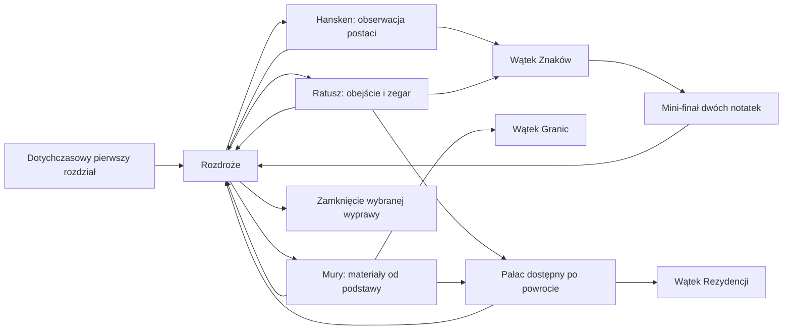
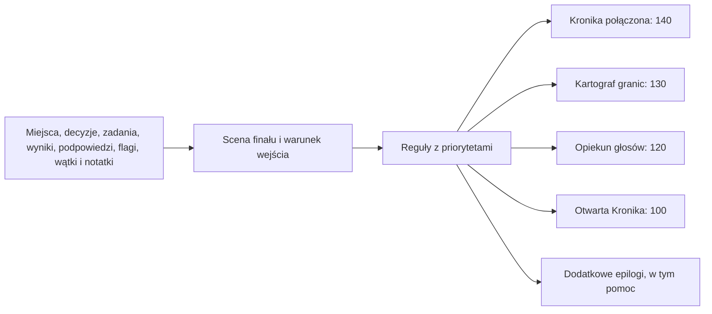

# Etap 12 — pierwsza wielowątkowa kampania

**Status: CZĘŚCIOWO GOTOWE — Etap 12 nieukończony.**

[Status projektu i kategorie](status-projektu.md) · [README](../README.md) ·
[raport Etapu 11](status-etap-11.md) · [rekonesans](rekonesans-terenowy.md)

| Status | Zakres |
| --- | --- |
| GOTOWE TECHNICZNIE | Reprezentatywna kampania, cztery nowe zadania i zakończenia, walidacja grafu, lokalny ślad GPS i zachowanie starych zapisów |
| CZĘŚCIOWO GOTOWE | Pełna kampania i panorama centrum: działają rozszerzenie oraz POC, brak odbioru całości |
| WYMAGA_REKONESANSU | Wszystkie 7 miejsc runtime i 83 kandydatów banku; zero zatwierdzonych miejsc |
| DO_WERYFIKACJI | Robocze punkty mapy, kandydaci odpowiedzi, realny GPS, telefon, bateria i historia murów |
| PLANOWANE | Kolejne punkty i wątki, ręczna ilustracja, docelowy szelest zwoju i nagrania |

Stan: rozpoczęty, 2026-10-04. Działa reprezentatywne rozszerzenie kampanii,
ale nie zatwierdzono jeszcze contentu w terenie ani docelowej mapy artystycznej.
Ten dokument nie jest protokołem odbioru całego Etapu 12.

## Audyt i rozszerzenie istniejącego modelu

Etap 11 miał deterministyczny Quest Engine, osobny runtime Ink, zapis formatu 1
z przypiętym pakietem, PWA, opcjonalne GPS/audio i 1080 ścieżek vertical slice.
Scena i lokalizacja były odrębnymi kontraktami, lecz interfejs odwoływał się
do jednej sceny wejściowej miejsca. Zadania i zakończenia miały już warunki DSL.
Nie wymagało to zastąpienia silników ani wprowadzenia drugiego stanu mechaniki.

Rozszerzenie powstało w kolejności: audyt, opcjonalne schematy i testy modelu,
zachowanie starego pakietu/zapisu, cztery zadania, wątki, reguły zakończeń,
świadectwa grafu i integracja interfejsu. `pakiet-kampanii.ts` łączy istniejący
pakiet z `tresc/kampania/kampania.json` i kompiluje wspólnie obie narracje.
Vertical slice pozostaje osobno budowany i testowany. Nowa sesja używa
`kampania-12.1`; stara sesja odtwarza własny, niezmienny pakiet.

Kampania zawiera 7 lokalizacji, 5 wątków (2 wcześniejsze i 3 nowe), 6 zadań,
6 zagadek, 31 decyzji, 5 przedmiotów i 22 reguły zakończeń/epilogów.
Nowe reguły główne są cztery. Większość miejsc nie musi zostać ukończona,
żeby zamknąć wyprawę. Powrót do rozdroża działa także po pominięciu zagadki.

## Quest Engine i Ink

`StanGry` jest jedynym źródłem prawdy o mechanice. Zdarzenia przechodzą przez
`wykonajKrok`; wynik jest odtwarzalny z dziennika. Ink dostaje kopię kontekstu,
opisuje scenę i emituje tag `sygnal:id_wyboru`. Most sprawdza legalność wyboru
w silniku, wykonuje zdarzenie, a dopiero potem przesuwa narrację.

`kampania.powiazaniaNarracji` wiąże zmienne Ink z kontekstem stanu gry. Opcjonalne
`warunek` powiązania wylicza wartość logiczną przez istniejący DSL Quest Engine
w obszarze `flagi`; nie zapisuje jej do `StanGry.flagi`.
Brak flagi oznacza `false`, brak wyniku pusty tekst. Ink nie ustawia nagród,
ukończenia zadań, obecności, odblokowania miejsca ani zakończenia.
`kampania.scenyMiejsc` pozwala odwiedzić to samo miejsce w innej scenie
(Hansken), bez tworzenia drugiej fizycznej lokalizacji.

Przykłady konsekwencji działających w grze:

- Decyzja o zachowaniu głosów przy Ratuszu zmienia wypowiedź Kronikarki przy murach.
- Wynik obserwacji Hansken zmienia sposób rozpoczęcia sceny Ratusza.
- Decyzja przy murach zmienia interpretację bryły Pałacu.
- Dwie udane obserwacje odblokowują mini-finał łączenia notatek.
- Podpowiedź może zmienić zakończenie mimo identycznych decyzji i miejsc.

## Schematy contentu

| Rekord | Pola i znaczenie |
| --- | --- |
| Miejsce | `id`, `nazwa`, `idSceny`, źródła/klasyfikacja, status rekonesansu, wymagania dostępu, warunek; opcjonalne `geo` albo `punktMapy`, tryb potwierdzenia |
| Kandydat w banku | osobny identyfikator i nazwa, pochodzenie w PDF, status; trzy kandydaty zadań z poleceniem, odpowiedzią lub `null`, źródłem i statusem weryfikacji |
| Zadanie | miejsce, wątek, warunek, wymóg obecności oraz istniejące efekty i nagrody |
| Zagadka | identyfikator zadania/miejsca, opcjonalna scena, typ, polecenie, poprawne odpowiedzi, normalizacja, limit prób, podpowiedzi, pomoc, pominięcie i efekty poszczególnych wyników |
| Wątek | warunek dostępności, opcjonalności i wymagania do finału; opcjonalne `warunekAktywacji` i `warunekUkonczenia` |
| Wiedza | nazwa, tekst, źródła, klasyfikacja i warunek ujawnienia po ukończeniu zadania |
| Zakończenie | identyfikator, nazwa, rodzaj, priorytet, warunek złożony DSL, tekst rezultatu |
| Kampania | scena rozgałęzienia, scena i warunek finału, mapowanie scen miejsc, wiązania Ink, wiedza |

Nie ma liniowej listy poziomów. Przejścia należą do decyzji, dostępność do
warunków. Bank autora nie trafia do aplikacji i nie zdradza przyszłych celów.
Runtime nie zawiera masy niezweryfikowanych zadań z banku.

## Flagi i zakończenia

Flagi `zapisano_*` oznaczają powrót i decyzję, nie poprawność obserwacji.
`glos_*` oznacza interpretację, `polaczono_znaki` mini-finał.
`zadanie_<id>` silnik wyprowadza z pozytywnego wyniku powiązanej zagadki;
pominięcie i niepowodzenie go nie ustawiają. Przedmioty notatek także są
nagrodą udanego zadania. Liczba podpowiedzi i sposób rozwiązania pozostają
w `postepyZagadek` i `wynikiZagadek`. Nie zastępujemy tych danych jedną flagą.

Resolver wymaga rzeczywistej sceny finału oraz spełnienia `warunekFinalu`.
Potem stosuje istniejące priorytety reguł i komponuje epilogi. Nie istnieje
przycisk wybierający bezpośrednio jedno z czterech nowych zakończeń.

| Zakończenie | Przebieg wymagany oprócz zamknięcia kampanii |
| --- | --- |
| Kronika połączona | ukończone Znaki i Rezydencja, zadanie murów, połączenie notatek, samodzielny Hansken bez podpowiedzi, notatka muru |
| Kartograf granic | ukończony wątek Granic i zadanie Ratusza, decyzja zachowania źródła przy murze, samodzielne mury |
| Opiekun głosów | ukończona Rezydencja, zadanie Hansken, decyzja o głosach przy Ratuszu, odwiedzony Pałac |
| Otwarta Kronika | dostępna droga zamknięcia po co najmniej jednym powrocie; obejmuje wyprawy niepełne i zadania pominięte |

Epilog pomocy uwzględnia pomoc/podpowiedzi w czterech nowych zagadkach.
Stare zakończenia obsługują mini-finał vertical slice i przypięte stare sesje.

## Rzeczywisty content i rekonesans

| Miejsce / zadanie end-to-end | Potwierdzona podstawa odpowiedzi | Pozostałe sprawdzenie |
| --- | --- | --- |
| Hansken, Rynek 26 — postać obok słonia | [Gmina: sgraffito z poganiaczem](https://trzebiatow.pl/gmina-trzebiatow-dla-turysty.html) | aktualna czytelność, miejsce bezpiecznej obserwacji |
| Ratusz — liczba tarcz zegara | [Gmina: zegar czterotarczowy](https://trzebiatow.pl/zabytki-gminy-trzebiatow.html) | widoczność każdej strony i dostępność obejścia |
| Zachodni mur — dwa materiały od dołu | [WUOZ: kamienna podstawa, ceglane mury](https://www.skz.szczecin.pl/index.php/ochrona-zabytkow/pomniki-historii/trzebiatow) | wybór dokładnego odsłoniętego odcinka, roślinność i dostęp |
| Pałac — litera z połączenia skrzydeł | [WUOZ: rzut L](https://www.skz.szczecin.pl/index.php/ochrona-zabytkow/pomniki-historii/trzebiatow), [NID](https://zabytek.pl/pl/obiekty/trzebiatow-palac) | widok obu skrzydeł bez wchodzenia na teren zamknięty |

Każda z tych zagadek ma odpowiedź źródłową, podpowiedzi, pomoc, kilka wyników,
decyzję, nagrodę, wiedzę po rozwiązaniu i powrót do wyboru celu.
Wpisanie odpowiedzi wymaga deklaracji obecności przy miejscu.
Przycisk pomocy/pominięcia umożliwia wyjście, jeśli detal jest niedostępny.
Źródło historyczne nie jest pomiarem dzisiejszej dostępności.

**Miejsca zatwierdzone rekonesansem: brak.** Wszystkie siedem miejsc runtime
(Rynek, Hansken, Kościół Macierzyństwa NMP, Baszta Kaszana, Ratusz, mury,
Pałac) i 83 kandydatów banku wymagają wizyty. Robocze punkty mapy trzech
nowych miejsc pochodzą z obiektów OSM, mają `DO_WERYFIKACJI` i służą tylko
do przedstawienia miejsca. Nie mają wymyślonego promienia zaliczenia GPS.
Nowe miejsca potwierdza się ręcznie; wcześniejsze robocze GPS slice pozostają
zgodne z własnym pakietem, bez deklaracji ich terenowego zatwierdzenia.

Bank przeniesiono z przekazanego `Trzebiatow_Encyklopedia_miejsc_i_bank_zadan_v0.1.pdf`:
83 osobne pozycje i 249 kandydatów zadań, z numerami stron. Nie złączono
Ratusza z Rynkiem, wieży z kościołem ani kilku fortyfikacji w jeden kandydat.
Niepotwierdzone odpowiedzi pozostają `null` / `DO_WERYFIKACJI`.

Bank jest teraz [centralnym rejestrem lokalizacji](rejestr-lokalizacji.md):
wszystkie 83 id i nazwy oraz 249 kandydatów zadań zachowano. Rekordy mają
opisy źródłowe, typy, rozwiniętą bibliografię, osobne statusy informacji,
rekonesansu i współrzędnych, propozycje motywów oraz odniesienia do istniejącego
runtime. Brak potwierdzonych współrzędnych oznaczono `null` / `DO_WERYFIKACJI`.
Walidacja kompletności jest częścią budowy treści. Nie wybrano finalnej trasy.

Następna redakcja [banku kandydatów zadań](bank-zadan-terenowych.md) zachowuje
249 propozycji, ale zastępuje quizy poleceniami obserwacji rzeczywistego terenu.
Każdy kandydat ma osobny id, cel, źródła i wymagania rekonesansu. Wszystkie
odpowiedzi pozostają `null` / `WYMAGA_REKONESANSU`. Rejestr dopuszcza do trzech
kandydatów na miejsce; żaden nie jest automatycznie wybierany ani aktywowany.

## Mapa: dane, warstwy i ograniczenia proof-of-concept

Analiza wszystkich dziesięciu referencji poprzedziła projekt mapy:

- Obrazy 1–3 i 6 pokazują stosunek miasta do meandrów Regi, Młynówki,
  dzielnic i terenów zielonych. Nie służą do odrysowywania produkcyjnej geometrii.
- Obrazy 4–5 pokazują gęste, nieregularne kwartały centrum, osobne obiekty,
  ulice i mosty. Obrót zbliżenia nie jest docelową orientacją geograficzną.
- Obrazy 7 (Paryż), 8 (Bristol), 9–10 (ten sam Douai) definiują gęstość
  zabudowy, akwarelę, dachy/elewacje, ramę i perspektywę. Nie dostarczają
  ulic ani fortyfikacji Trzebiatowa.

Własna geometria opiera się na wycinku OSM bbox `15.253,54.057,15.281,54.068`
i pełnych relacjach cieków `3246784`, `17840805` z API `/full`.
Import `narzedzia/importuj-geometrie.py` odtwarza `tresc/mapa/geometria.json`
z trzech plików `.osm.gz`. Zapisuje datę, adresy i SHA-256 źródeł.
Zawiera 2105 obiektów, 982 obrysy budynków, drogi, piesze ciągi, mosty,
zieleń, osie cieków, domknięte brzegi i wyspę. Ratusz zachowuje dziedziniec
z relacji multipolygon. Współrzędne nie są odrysowane z Google.

Dane i pochodne geometrii udostępniamy na [ODbL 1.0](https://www.openstreetmap.org/copyright).
Atrybucja © OpenStreetMap contributors jest w mapie i w danych;
osobne metadane licencji znajdują się w `tresc/mapa/README.md`.
OSM nie potwierdza fizycznej dostępności wejść, dokładnego punktu zaliczenia
ani historycznego przebiegu niezachowanych murów.

| Moduł | Odpowiedzialność |
| --- | --- |
| `mapa/geometria.ts` | odczyt rzeczywistej geometrii, lokalna projekcja, perspektywa 68°, odwrotna transformacja |
| `mapa/nakladka-historyczna.ts` | źródłowe odcinki i pewność; niepewne bramy bez pozycji |
| `mapa/warstwa-artystyczna.ts` | kolory pergaminu, dachy/elewacje na realnych obrysach, zieleń, woda i napisy |
| `mapa/warstwy-gracza.ts` | dostępne/odwiedzone miejsca, historyczne rysowanie i osobny rzeczywisty ślad |
| `mapa/interakcja.ts` | pan, pinch, zoom i sterowanie przyciskami |
| `Mapa.tsx`, `mapa/pergamin.css` | kompozycja warstw, znaczniki, pozycja nad śladem, rozwijanie i UI |
| `slad-gps.ts`, `uzyjSladuGps.ts` | walidacja pomiarów i lokalny zapis, niezależne od rysowania |

GPS → lokalne metry → perspektywa → wspólna skala/pan → ekran.
Wszystkie warstwy używają tej samej transformacji; testy obejmują odwracalność,
zoom/pan i zmianę proporcji ekranu. Wysokości ogólnej zabudowy są ilustracyjne.
Sylwetki Ratusza, kościoła, Kaszanej i Pałacu korzystają z ich obrysów OSM
i opisów instytucjonalnych. Podział brył/detali wymaga dalszej pracy artysty;
nie jest inwentaryzacją 3D. NID/gmina opisują całą wieżę kościoła jako 90 m;
tag OSM 50 m nie został utożsamiony z dokładną wysokością całego obiektu.

Trzy poziomy zoomu zmieniają szczegóły dróg, napisów i kreskowania.
Na małym ekranie kolidujące przyciski zmieniają się w małe kotwice w swoich
rzeczywistych punktach; lista miejsc pozostaje dostępna. Warstwa gameplay
pokazuje odwiedzone miejsca, bieżący cel i legalne alternatywy. Landmarki
geograficzne są częścią miasta, bez ujawniania statusu przyszłych zadań.

Animacja otwarcia trwa maksymalnie 480 ms, ma przycisk pominięcia,
nie powtarza się w tej sesji karty, a EKO/reduced-motion usuwa jej efekty.
Korzysta z istniejącego opcjonalnego efektu kartki; docelowe nagranie
rozwijania zwoju pozostaje w backlogu audio. Nie ma animacji całej trasy.
EKO ogranicza gęstość canvas i kreskowanie; geometria i GPS zaliczenia
pozostają wspólne. Mapa i dane ładowane na żądanie, cache po pierwszym otwarciu.

Historyczny rejestr powstał przed rysowaniem nakładki:
[Fortyfikacje](mapa/historyczne-fortyfikacje-trzebiatowa.md).
Nie rysujemy niepewnych bram ani wymyślonego domknięcia murów. Pełny przebieg
niezachowanych fortyfikacji wymaga georeferencji planów i dokumentacji WUOZ.

POC ma gęstą legalną geometrię i przestrzenne kolorowe przedstawienie centrum.
[Zrzut fragmentu na ekranie 390 px](mapa/pergamin-poc-390.png) pochodzi z testu
Chromium z symulowanymi pomiarami GPS; nie jest dowodem spaceru terenowego.
**Nie potwierdzono warunku odbioru R podczas rzeczywistego spaceru ani
docelowej jakości ręcznej ilustracji.** Wymaga przeglądu landmarków, orientacji
i czytelności w słońcu na telefonie przed poszerzeniem obszaru.

## Ślad GPS, prywatność, zapis

GPS mapy, rejestrowanie śladu i widoczność linii to trzy niezależne ustawienia.
GPS i rejestracja domyślnie są wyłączone. Ukrycie śladu nie wyłącza GPS,
znacznika pozycji ani miejsc. Po wznowieniu GPS wymaga ponownego włączenia.
Znacznik opisuje ostatni zaakceptowany pomiar, nie gwarantowaną obecną pozycję.

Filtr przyjmuje poprawne współrzędne, dokładność do 40 m, rosnący timestamp,
odrzuca pomiar starszy niż 120 s albo z przyszłości ponad 5 s i skoki ponad
`max(20 m, 5 m/s × odstęp)`. Punkt śladu wymaga co najmniej 3 s i ruchu
4–12 m zależnie od dokładności. Przerwa ponad 60 s, wyłączenie GPS albo
rejestracji zaczyna nowy odcinek; nie łączymy luki fikcyjną linią.
Nie dopasowujemy pomiarów do ulic i nie przedłużamy śladu do celu.

Rendering Douglas–Peucker ma limit odchylenia 0,25 m osobno dla odcinków.
Pełny zaakceptowany ślad zostaje w zapisie; jitter i złe odczyty nie trafiają
do historii. Karmazynowa krawędź nie przesuwa osi pomiarów.
EKO ogranicza aktualizacje pozycji bez nowego punktu do 5 s (pełny tryb 1 s).
Przyjęty nowy punkt odświeża linię od razu. Nie deklarujemy pomiaru oszczędności
baterii na fizycznym telefonie; `watchPosition` zależy również od przeglądarki.

IndexedDB v1 → v2 dodaje `sladyGps`, bez usuwania `zapisy` i `pakiety`.
Stan gry/Ink nadal ma format 1: flagi, wyniki, wątki, przedmioty i decyzje
wchodzą do dotychczasowego serializowanego stanu. Nie podmieniamy automatycznie
przypiętego starego Ink nową fabułą i nie kasujemy postępu użytkownika.

Ślad zapisujemy lokalnie pod `idSesji`, poza pakietem treści i narracją.
Nie ma wysyłania GPS ani synchronizacji konta. Czyszczenie opróżnia ślad,
wyłącza rejestrację i zostawia znacznik; zwiększa generację zapisu,
aby stara otwarta karta nie przywróciła usuniętych punktów.
Nowa wyprawa ma nowy identyfikator i pusty ślad; poprzedni zapis trafia
do lokalnej kopii `archiwum_<idSesji>`. Interfejs przeglądania tych kopii
nie jest częścią tego rozszerzenia. Ślad poprzedniej sesji pozostaje oddzielny.

## Graf, flagi i walidacja

Budowa sprawdza odwołania, źródła, sceny, sygnały Ink i flagi odczytywane
bez możliwości ustawienia. Dwa wcześniejsze ostrzeżenia o flagach nigdy
nieczytanych pozostają jawne; nie oznaczają odczytu nieustawialnej flagi.

Graf strukturalny używa BFS i odwrotnego BFS O(V+E) do wykrywania miejsc
nieosiągalnych i bez wyjścia. Dodatkowo 153 rzeczywiste świadectwa sprawdzają
legalne kolejności, wybory, pięć wyników zagadek, mini-finał, epilog pomocy
i wszystkie cztery zakończenia wraz z Mostem Ink. Nie enumerujemy iloczynu
wszystkich historii. To nie dowód wszystkich możliwych kombinacji warunków;
nowa gałąź lub reguła bez świadectwa zatrzymuje build i wymaga rozszerzenia
zestawu. Dawne 1080 dróg to tylko regresja osobnego slice, nie limit kampanii.

Historyczne wyniki implementacji z 2026-10-04 (commit `75aef33`).
Bieżące bramki: [status projektu](status-projektu.md#bieżąca-weryfikacja).
Poniższe wyniki nie oznaczają odbioru Etapu 12:

| Kontrola | Wynik |
| --- | --- |
| Build obu aplikacji, pakietów i treści | PASS |
| Testy automatyczne | 235/235 PASS |
| Typecheck workspace, treści i E2E | PASS |
| Graf slice / nowa kampania | 1080 regresji / 153 świadectwa PASS |
| Flagi odczytywane bez setterów | 0 |
| E2E Chromium | 16/16 PASS: offline, wznowienie, nowe zakończenie, GPS/trasa, nowa sesja, axe i szerokości 320–768 px |
| Budżety gzip i lazy Etapu 8 | PASS, bez podwyższania progów |
| Lint plików projektu | PASS |
| Root `npm run lint` | zastany FAIL: dwa błędy formatowania/importów w nieśledzonym skrypcie użytkownika `zastap_teksty_trzebiatow_v2.mjs`; plik niezmieniony |
| `git diff --check` | PASS |
| Rekonesans / telefon w słońcu / bateria / pełna historia murów | NIEZWERYFIKOWANE |

Pomiar narzędziem repo: initial JS 112212 B gzip, sesja 52298 B, mapa 6153 B.
Budżet sesji ma tylko 105 B zapasu. Przed znacznie większą porcją contentu
trzeba rozdzielić dostarczanie pakietu treści od kodu runtime zamiast
podnosić limit. Dane mapy to osobny zasób 647447 B (około 138 kB gzip),
poza initial/precache. Powtórny import ze snapshotów daje identyczny SHA-256.

## Kolejne rozszerzenie

1. Rekonesans czterech zadań: fotografie detali, warunki obejścia, punkt
   obserwacji, bezpieczne alternatywy; dopiero wtedy współrzędne zaliczenia/GPS.
2. Odbiór POC w centrum: Rynek, Ratusz, kościół, Kaszana, Pałac, oba cieki
   i mury; dopracowanie indywidualnych brył i ręcznej warstwy ilustracyjnej.
3. Georeferencja planów fortyfikacji, osobna identyfikacja czatowni i bram
   z dokumentacją konserwatorską. Nie uruchamiać rekonstrukcji z domysłu.
4. Wybrać ręcznie z zachowanego banku kolejne 3–4 niezależne punkty, np.
   gryf Ratusza, Most Dworcowy, Łabędzi Staw, konkretny mural. Najpierw
   źródła i obserwacje, potem nowe przecięcia obecnych wątków i świadectwa.
5. Biała Dama i Święto Kaszy: osobne wątki po zbadaniu źródeł legend,
   realnego detalu otwierającego scenę i warunków dostępności.
6. Docelowy szelest zwoju i nagrania narracji na istniejącym kanale audio,
   z zachowaniem pełnej gry bez dźwięku.

Warstwa źródłowa: [model informacji historycznych](zrodla-contentu.md).
Walidacja techniczna i cytowania 83 opisów są gotowe; potwierdzenie twierdzeń
pozostaje DO_WERYFIKACJI. Opisy encyklopedii mają poziom NIEPEWNE,
rekonesans pozostaje WYMAGA_REKONESANSU. Etap 12 nie jest ukończony.
Kontrola tej zmiany: build, 245 testów, typecheck, lint śledzonych plików
oraz `git diff --check` PASS. Pełny lint: FAIL — dwa wcześniejsze błędy
w nieśledzonym `zastap_teksty_trzebiatow_v2.mjs`. E2E nie ponawiano.

Robocza [sieć narracyjna](siec-narracyjna.md): 8 osi, 38 węzłów,
16 niezależnych wejść i 6 splotów. Model autora jest walidowany przy budowie;
nie aktywuje miejsc ani scen w runtime. Finalny wybór contentu pozostaje PLANOWANE.

## Obserwowalne konsekwencje istniejącej kampanii

Wspólny `przygotujKontekstNarracji(stan, powiazania)` obsługuje sesję gracza
oraz testy Ink. Odczytuje jeden StanGry. Nie powstał drugi stan, nowy format
zapisu ani mechanika terenowa. Starsze powiązania bez `warunek` nadal działają.
Warunek jest dozwolony wyłącznie dla wartości logicznych; walidator sprawdza
jego odwołania do istniejących zagadek, scenek, przedmiotów i wątków.

| Wcześniejsze działanie | Widoczna późniejsza konsekwencja |
| --- | --- |
| Decyzja o głosach przy Ratuszu | Inna interpretacja murów przez Kronikarkę |
| Rozwiązanie, pominięcie lub niepowodzenie Hansken | Ratusz odwołuje się do rozpoznania albo jawnie otwartej notatki |
| Faktycznie wykorzystana podpowiedź Hansken | Osobny akapit przy Ratuszu i w finale; epilog pomocy z istniejącego resolvera |
| Odkrycie scenki dwóch notatek w pierwszym rozdziale | Powrót rozróżnienia obserwacji i opowieści przy Pałacu oraz w finale |
| Ukończenie Granic i posiadanie notatki muru | Wariant celu „Porównuję notatkę murów z Pałacem”, akapit Pałacu i finału |

Wariant celu prowadzi do istniejącego Pałacu; nie dodaje lokalizacji.
Standardowy cel i możliwość zamknięcia niepełnej wyprawy nadal działają.
Interpretacje mają oznaczenie FABULARYZOWANE i nie dopisują faktów historycznych.
Sceny zwięźlej przekazują dotychczasowe instrukcje, zachowując adresy, zasady
bezpiecznej obserwacji oraz możliwość pominięcia niedostępnego widoku.

Testy porównują rzeczywisty tekst Ink po różnych dziennikach zdarzeń,
widoczne opcje SesjaGry i późniejsze sceny po wznowieniu zapisu. Sprawdzają
obecność konsekwencji w wariancie pozytywnym i jej brak w kontrolnym.
Przebiegi grafu obejmują także nowy wariant celu. Istnienie flagi samo w sobie
nie jest dowodem widocznej konsekwencji. Nie jest to odbiór Etapu 12 ani terenu.

Kontrola konsekwencji: build, 257 testów, typecheck, lint zmienionego kodu,
limity gzip/lazy i `git diff --check` PASS. Pełny lint nadal FAIL przez dwa
wcześniejsze błędy w skrypcie użytkownika; E2E i terenu nie ponawiano.

[Architektura zakończeń](zakonczenia.md): resolver komponuje zakończenie
główne, warianty, epilogi i odkrycia z przebiegu gry. Nowe reguły kampanii
mają jawne sceny wejścia; walidacja łączy analizę logiczną i świadectwa resolvera.
Etap 12 pozostaje nieukończony.

Przykładowe teksty finałów skrócono; dodano jeden wariant Otwartej Kroniki.
Warunki głównych zakończeń pozostają oparte na przebiegu wyprawy.

[Kronika zdobytej wiedzy](kronika.md) pokazuje wyłącznie odblokowane wpisy,
wyniki zagadek, ślady i postęp wątków. Rozdziela fakt, przekaz i fabularne zdarzenia;
brak potwierdzenia oznacza informację do weryfikacji. Filtry i paginacja ograniczają
liczbę kart. Rozszerzenie widoku nie oznacza ukończenia Etapu 12.

### Wątki i wybór następnego celu

Widok pokazuje tylko rozpoczęte wątki (AKTYWNY, UKONCZONY, POMINIETY),
ich ogólny stan oraz zdobyte przedmioty/ślady i przeczytane scenki.
Wskazówki prezentowane są wspólnie: istniejący model nie przypisuje każdej
z nich do konkretnego wątku. Nie dopisano takich powiązań na podstawie domysłów.
Wątki ZABLOKOWANY, DOSTEPNY i nieobecne w stanie nie ujawniają nazw.

`czyWyborDostepny` w Quest Engine jest wspólną kontrolą polecenia wyboru
i adaptera sesji. Most Ink dodaje do zatwierdzonych opcji ich identyfikatory.
Lekka projekcja `@zwiedzanie/silnik-gry/wyprawa` otrzymuje te opcje i kanoniczny
stan; zwraca wyłącznie cele aktualnej sceny z odblokowanymi lokalizacjami.
Nie ocenia ponownie warunków w UI. Osobne wejście projekcji nie importuje
schematów runtime ani całego silnika do początkowej paczki interfejsu.

Mapa i widok wątków korzystają z tej samej listy celów. Przy równoległych
kierunkach gracz widzi nazwy miejsc i teksty legalnych opcji Ink; przycisk
wykonuje istniejący wybór sesji i otwiera Opowieść. Nie dodaje zdarzeń ani stanu.
Brak celu w bieżącej scenie oznacza kontynuację Opowieści, nie listę przyszłych
miejsc. W widoku nie ma całego grafu, sekretów ani przyszłych finałów.

Kontrola 2026-10-04: pełny build, 275 testów (8 fundamentu, 21 narracji,
67 silnika, 66 treści, 113 UI), typecheck, lint zmienionego kodu, dotychczasowe
limity gzip/lazy i `git diff --check` PASS. Nowe testy obejmują ukrywanie
przyszłych miejsc, nierozpoczętych wątków i niezdobytych wskazówek, brak nazw
zakończeń w DOM, wybór Ratusza z rozdroża oraz zgodność projekcji po wznowieniu.
Pełny lint nadal FAIL przez dwa zastane błędy skryptu użytkownika.
E2E i odbioru fizycznego telefonu nie ponawiano w tej zmianie.
