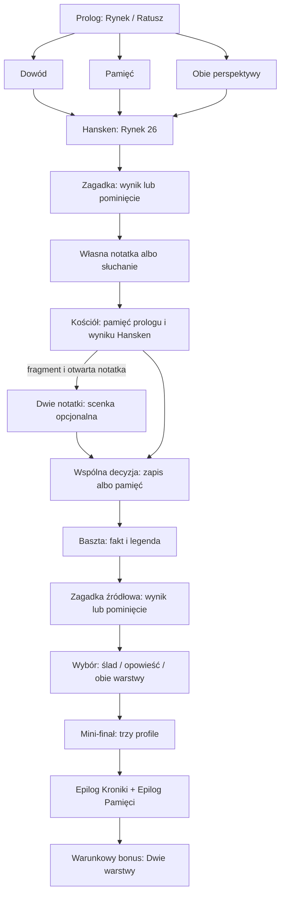

TEKST ROBOCZY — NIE JEST TO FINALNA WERSJA FABULY.

# Etap 4 — wielowątkowy vertical slice

Pakiet `tresc/trzebiatow-v1` jest krótką kampanią dla Silnika Gry i Silnika Narracji. Aplikacja nie ma jeszcze ekranów rozgrywki. Tekst jawnie oddziela fakty, legendę i fikcyjną Kronikę. Krótkie akapity są przeznaczone do czytania przy kolejnych przystankach; tempo wymaga sprawdzenia na telefonie.

## Miejsca i pokrycie źródłami

| Miejsce | Treść i klasyfikacja | Źródło |
| --- | --- | --- |
| Rynek / Ratusz | FAKT: ratusz w centrum rynku. Pusta karta Kroniki: FABULARYZOWANE. | `gmina_zabytki` |
| Hansken, Rynek 26 | FAKT źródłowy: sgraffito i wizyta słonicy w 1639 r. Bez twierdzenia o kopii Rembrandta. Fragment gry: FABULARYZOWANE. | `wzp_hansken` |
| Kościół Macierzyństwa NMP | FAKT źródłowy: gotycki obiekt, masyw wieżowy i dzwon Maria z 1515 r., Lütke Rose. Nie oznacza dzisiejszej dostępności dzwonu. | `nid_kosciol` |
| Wieża kościoła | TRADYCJA / DO SPRAWDZENIA: materiał gminny przypisuje funkcję latarni morskiej. Przekaz przypisany autorowi, bez potwierdzania mechanizmu działania. | `gmina_zabytki` |
| Baszta Kaszana / Prochowa | FAKT: obiekt fortyfikacyjny. LEGENDA: strażnik, gorąca kasza i alarm; nie potwierdzony przebieg bitwy. | `gmina_zabytki` |

Źródła przeczytane 2026-10-02 — data odczytu internetowego, nie rekonesansu:

- [Gmina Trzebiatów — zabytki](https://trzebiatow.pl/zabytki-gminy-trzebiatow.html).
- [Samorząd województwa — sgraffito Hansken, karta 3726](https://rowery.wzp.pl/en/3726-pomorze-zachodnie-sgraffito-of-hansken-the-elephant-on-the-facade): dostępna wersja angielska, adres i rok wizyty.
- [NID / Zabytek.pl — Kościół Macierzyństwa NMP](https://zabytek.pl/pl/obiekty/trzebiatow-kosciol-par-pw-macierzynstwa-nmp): Maciej Słomiński, OT NID Szczecin, nota 2020-05-15.

Klasyfikacja lokalizacji opisuje obiekt, nie wszystkie akapity sceny. Rejestr scen oznacza mieszane sceny opowieści jako FABULARYZOWANE; akapity historyczne w Ink mają jawne etykiety i ID źródeł. Zod sprawdza klasyfikację i referencje, ale prawdziwość zdań wymaga oceny źródeł przez autora.

## Wątki i decyzje

`watek_kroniki`: dowód, zapis i materialny ślad. `watek_pamieci`: legenda, pamięć i opowieść. Oba są aktywowane w prologu i zamykane po dojściu do mini-finału. Nie oznaczają dobrej i złej drogi.

Cztery grupy istotnych decyzji:

1. Prolog: dowód / pamięć / obie perspektywy. Zapisuje wybór i powinowactwa; treść wraca przy Kościele.
2. Hansken: własna notatka albo słuchanie. Flaga `otwarto_notatke` współdecyduje o scence.
3. Kościół: zapis informacji ze źródłem albo pytanie o pamięć. Zmienia powinowactwa; obie drogi zbiegają się przy Baszcie.
4. Baszta: pierwszeństwo śladu / opowieści / obu warstw. Końcowy wybór nadaje porządek zapisowi gracza. Wcześniejsze decyzje pozostają w stanie, reakcji tekstowej i dodatkach; profil nie jest ukrytym rankingiem punktów.

Wejście i powrót obsługują dodatkowo scenkę. Łącznie jest 14 ID wyborów, w tym warianty decyzji Kościoła po scence.

## Zagadki, ślad i scenka

`zagadka_hansken` jest szkicem obserwacji: `wymagaWeryfikacjiTerenowej: true`, `odpowiedz: null`. Wyniki w testach są symulowanymi zdarzeniami, nie dowodem istnienia sprawdzalnego detalu. Nie ma zatwierdzonej odpowiedzi terenowej ani automatycznego sprawdzania odpowiedzi.

`zagadka_baszta` polega na rozpoznaniu legendy w podanym tekście. Odpowiedź `opowiesc_o_misce_goracej_kaszy` odnosi się do źródła, nie do ukrytego znaku na obiekcie; sama odpowiedź nie wymaga rekonesansu.

Obie obsługują pięć wyników: samodzielnie, z podpowiedzią, z pomocą, pominięta i nieudana. Po nieudanej próbie można ponowić albo pominąć; enumerator wybiera pominięcie jako wyjście. Rozwiązanie Hansken przyznaje fikcyjny `fragment_kroniki_hansken` i powinowactwo zależne od pomocy. Pominięcie nie daje fragmentu. Baszta zapisuje rozróżnienie warstw i konsekwencję wyniku.

`scenka_dwie_notatki` wymaga fragmentu i otwartej notatki. Można ją ominąć i kontynuować. Przeczytanie wraca do wspólnej decyzji Kościoła. Ślad jest przedmiotem gry, nie autentycznym dokumentem historycznym.

## Zakończenie i moduły

Silnik wyznacza `zakonczenieGlowne + epilogiWatkow + specjalneOdkrycia + konsekwencjeZagadek`.

- KRONIKARZ: w finale pierwszeństwo potwierdzonych śladów.
- STRAŻNIK OPOWIEŚCI: pierwszeństwo pamięci, z zachowaniem etykiety legendy.
- ŁĄCZNIK: obie warstwy bez zacierania różnic; bezpieczny profil domyślny.

Dwa osobne, krótkie węzły Ink tworzą epilogi wątków. Oba wątki są wymagane przed finałem, więc oba epilogi pojawiają się na każdej drodze. Bonus `odkrycie_dwie_warstwy` wymaga samodzielnego Hansken, odkrytej scenki i fragmentu. Nie czyni zakończenia lepszym. Most przekazuje kopię stanu; mechanikę, nagrody i flagi ustanawia Silnik Gry.

## Budowanie i walidacja

`npm run build:tresc` czyta YAML, waliduje Zod, kompiluje Ink, sprawdza referencje scen oraz zgodność dróg z wyborami i finałem narracji. Generuje ignorowane `dist/pakiet.json` i `dist/glowna.json` w pakiecie. Pełny build również wykonuje tę bramkę. JSON nie jest edytowany ręcznie.

Parser `yaml` 2.9.1 jest zależnością narzędzi autora (devDependency): YAML 1.2, licencja ISC, brak zewnętrznych zależności runtime, Node >=14.6; projekt wymaga Node 24. Wybór: [dokumentacja biblioteki](https://eemeli.org/yaml/). Odrzucamy błędy, ostrzeżenia, powtórzone klucze i aliasy. Zod odrzuca nieznane pola i nieprawidłowe referencje.

Testy negatywne: duplikat/brak ID, brak źródła, przedmiotu i wątku, niepoprawny wynik i klasyfikacja, scena nieobecna w rejestrze/Ink, nieosiągalny główny finał.

| Droga | Prolog | Hansken | Baszta — wybór | Profil |
| --- | --- | --- | --- | --- |
| A | dowód | samodzielnie | fakt | KRONIKARZ |
| B | pamięć | z podpowiedzią | legenda | STRAŻNIK OPOWIEŚCI |
| C | obie perspektywy | pominięta | obie warstwy | ŁĄCZNIK |

Enumerator sprawdza 900 kombinacji: 3 prologi × 5 wyników Hansken × 2 decyzje notatki × 2 decyzje Kościoła × 5 wyników Baszty × 3 finały. Po aktualizacji Etapu 6 dodaje 180 wariantów z dostępną scenką: **1080 dróg**. Pomoc nie daje fragmentu za obserwację; wszystkie pięć wyników zachowuje kontynuację. Każda dochodzi do mini-finału, zamyka wymagane wątki, ma profil i przechodzi odpowiadające wybory Ink. Brak scenki nie blokuje żadnego podstawowego wariantu. Drogi A/B/C sprawdzają także epilogi i bonus.

Dowód dotyczy zdefiniowanych skończonych dróg, w tym świadomego zakończenia zadania bez rozwiązania i pominięcia. Nie obejmuje dowolnych zmian kampanii, nieskończonych powtórzeń ani warunków spaceru w mieście. Build ponawia enumerację po zmianie danych.

## Rekonesans — NIETESTOWANE

Nie przeprowadzono wizyty terenowej. Brak dat `zweryfikowanoTerenowoDnia`.

| Element | Do sprawdzenia przed zatwierdzeniem |
| --- | --- |
| Rynek / Ratusz | Bezpieczny punkt rozpoczęcia, dojście i postój grupy. |
| Hansken | Widoczność z publicznego miejsca, światło, przesłony, rzeczywisty rozpoznawalny detal. Dopiero potem pytanie, odpowiedź i podpowiedź. |
| Kościół | Bezpieczny postój i dostępność otoczenia; przejście nie wymaga wnętrza, dzwonu ani wieży. Funkcję nawigacyjną dodatkowo sprawdzić źródłowo. |
| Baszta | Publiczne dojście i miejsce postoju; bez wymogu wejścia na obiekt. |
| Cała trasa | Czas spaceru, bariery dostępności, jezdnie i czas czytania na telefonie. |

Etapy 5 i 6 rozszerzają interfejs i mechanikę, bez zatwierdzania zagadki terenowej ani finalnej fabuły. Aktualny kontrakt opisują [zagadki i zadania](zagadki-i-zadania.md).
